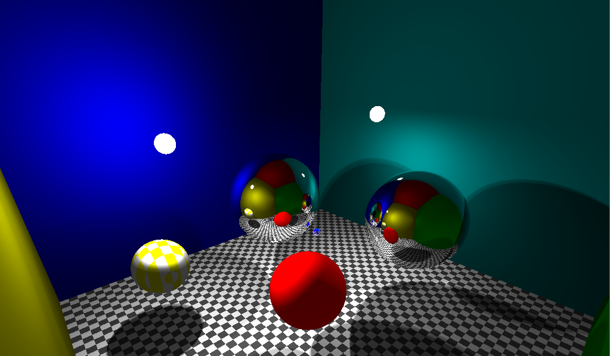

# RayTracer

This was my project in the "TSBK07 Computer Graphics" course at Linköpings University. It is a GPU accelerated raytracer with reflections,
refractions and shadows implemented in a compute shader. It runs in real-time and you can move the spheres and lights in the scene around.